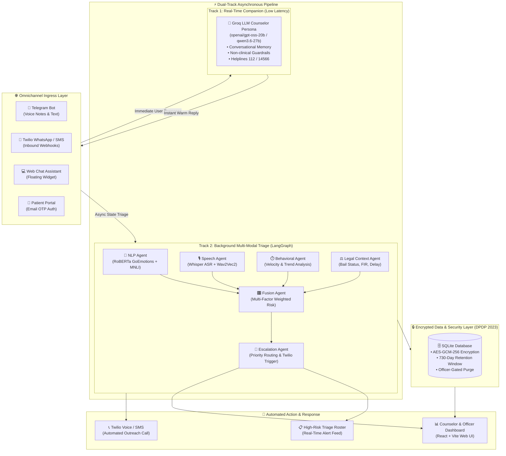
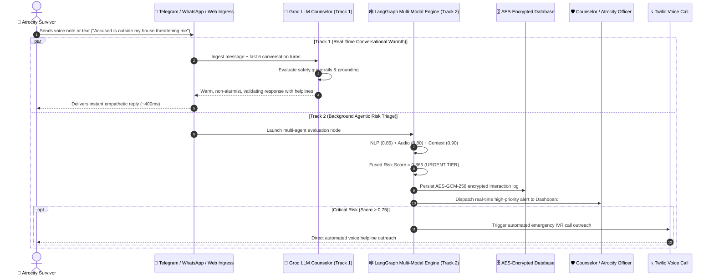
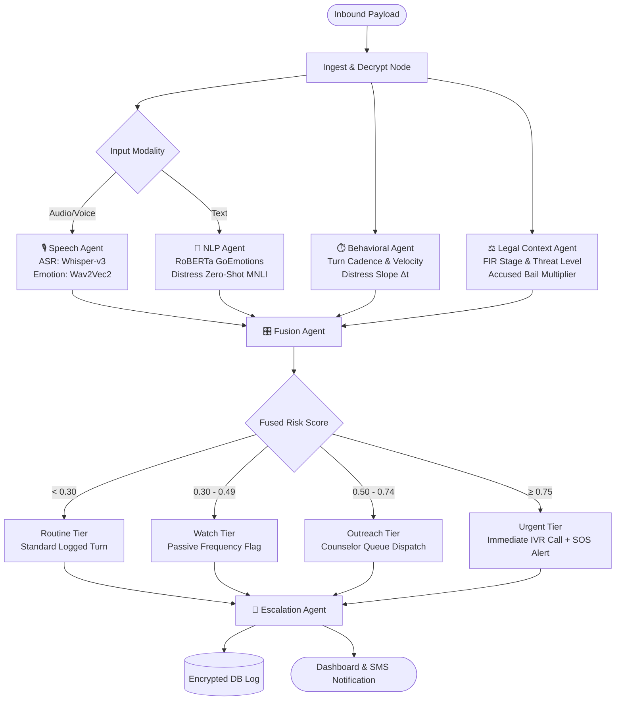

# 🕊️ Nyaya Sakhi — AI-Powered Multi-Modal Distress Prediction & Escalation System

### **Ministry of Social Justice and Empowerment (MoSJE) • National Helpline Against Atrocities (NHAA 14566)**


[](https://python.org)
[](https://fastapi.tiangolo.com)
[](https://react.dev)
[](https://vitejs.dev)
[](https://langchain-ai.github.io/langgraph/)
[](https://groq.com)
[](https://twilio.com)
[](https://brevo.com)
[]()
[]()

---

## 📌 Table of Contents
1. [Executive Summary & Problem Statement](#-executive-summary--problem-statement)
2. [End-to-End System Architecture](#-end-to-end-system-architecture)
3. [The Dual-Track Omnichannel Pipeline](#-the-dual-track-omnichannel-pipeline)
4. [Multi-Modal Agentic Reasoning Architecture (LangGraph)](#-multi-modal-agentic-reasoning-architecture-langgraph)
5. [Risk Classification Matrix & Thresholds](#-risk-classification-matrix--thresholds)
6. [Ingress Channels & Interfaces](#-ingress-channels--interfaces)
7. [Security, Privacy & DPDP Act 2023 Compliance](#-security-privacy--dpdp-act-2023-compliance)
8. [Repository Layout](#-repository-layout)
9. [Quick Start & Installation](#-quick-start--installation)
10. [Environment Configuration (.env)](#-environment-configuration-env)
11. [Automated Test Suite & Verification](#-automated-test-suite--verification)

---

## 🌟 Executive Summary & Problem Statement

Victims and witnesses under the **Scheduled Castes and Scheduled Tribes (Prevention of Atrocities) Act, 1989** often experience extreme emotional distress, trauma, social boycotts, and retaliatory intimidation—especially when accused perpetrators are granted bail or during prolonged judicial proceedings.

Traditional helplines are **passive and reactive**, requiring traumatized victims to articulate high-level crisis requests verbally.

**Nyaya Sakhi** is a proactive, multi-modal, agentic AI early-warning system integrated with the **National Helpline Against Atrocities (NHAA 14566)**. It provides:
1. **Omnichannel Ingress**: Continuous interaction via Telegram Voice/Text, Twilio WhatsApp/SMS/IVR, Web Chat, and a Self-Service Patient Portal.
2. **Dual-Track Processing**: Real-time conversational warmth powered by high-speed Groq LLMs while simultaneously running background multi-modal distress triage.
3. **Multi-Modal Sensor Fusion**: Combines NLP emotion/suicidal ideation detection, acoustic speech emotion recognition, temporal behavioral cadence, and legal case context.
4. **Proactive Automated Escalation**: Instant counselor alerts and automated Twilio IVR outreach for victims in high/critical distress tiers.
5. **DPDP Act 2023 Compliance**: AES-GCM-256 encrypted storage, explicit consent tracking, zero PII leaks, and automated officer-authenticated data retention/purge pipelines.

---

## 🏗️ End-to-End System Architecture



---

## ⚡ The Dual-Track Omnichannel Pipeline

Every inbound victim communication is processed along two parallel, asynchronous tracks:



---

## 🧠 Multi-Modal Agentic Reasoning Architecture (LangGraph)

The core triage engine is structured as a directed acyclic state graph built with **LangGraph**:



### 🔬 Agent Specification & Multi-Factor Weighting
| Agent | Primary Role | Weight | Key Metrics / Features |
| :--- | :--- | :---: | :--- |
| **NLP Agent** | Text emotion & distress evaluation | `35%` | Fear, grief, sadness, helplessness, suicide keyword flags |
| **Speech Agent** | Acoustic vocal emotion extraction | `25%` | Pitch variance, speech rate, vocal tremor, high-arousal distress |
| **Legal Context Agent** | SC/ST atrocity case vulnerability | `25%` | Accused bail status (granted/denied), threat reported, compensation delay |
| **Behavioral Agent** | Interaction velocity & pattern analysis | `15%` | Message frequency surges, night-time messaging, escalation velocity |
| **Fusion Agent** | Mathematical weighted synthesis | — | Normalized formula: $\text{Score} = \sum w_i \cdot s_i + \text{Penalties}$ |
| **Escalation Agent** | Priority routing & automated outreach | — | Counselor alert generation, Twilio IVR outreach, SMS notification |

---

## 🎯 Risk Classification Matrix & Thresholds

| Risk Tier | Score Range | System Action & Triage Strategy | Counselor UI Indicator |
| :---: | :---: | :--- | :---: |
| **Routine** | `0.00 – 0.29` | Silent logging, scheduled periodic check-ins, normal companion tone. | 🟢 Green Badge |
| **Watch** | `0.30 – 0.49` | Increased monitoring cadence, empathetic legal aid information. | 🟡 Yellow Badge |
| **Counselor Outreach** | `0.50 – 0.74` | Added to Counselor Priority Queue; human counselor follow-up scheduled. | 🟠 Orange Badge |
| **Urgent** | `0.75 – 1.00` | Automated Twilio emergency voice call outreach, instantaneous SOS escalation. | 🔴 Red Pulsing Badge |

---

## 💻 Ingress Channels & Interfaces

### 1. 🛡️ Counselor & Officer Web Dashboard (React + Vite)
- **Live Triage Roster**: Real-time sorted table of victims by risk tier with multi-modal explainability radar.
- **Victim Detail Modal**: Complete historical interaction timeline, case legal context, acoustic tremor metrics, and one-click manual outreach.
- **Live Channel Simulator**: Interactive test bench to simulate Telegram voice notes, WhatsApp text, and phone calls.
- **Patients Directory**: Searchable, filterable database of registered atrocity victims across districts.
- **DPDP Compliance Panel**: Officer-authenticated data purge triggers and audit logs.

### 2. 📱 Telegram Voice & Text Support Bot (`@nhaa_14566_sih_bot`)
- **Voice Ingress**: Native voice notes automatically converted to OGG/WAV, transcribed with Whisper, and analyzed for acoustic emotion.
- **Conversational Companion**: Uses Groq LLM (`openai/gpt-oss-20b` / `qwen3.6-27b`) with contextual memory of the last 6 turns.
- **Non-Clinical Guardrails**: Validates that responses provide comfort without claiming to be a licensed medical doctor or making specific court verdict predictions.

### 3. 💬 Twilio WhatsApp & SMS Webhooks (`/webhook/whatsapp-inbound`)
- Inbound WhatsApp and SMS routing with automated TwiML response generation.
- Dynamic fallback from WhatsApp to SMS when delivery fails.
- Strict deduplication window preventing duplicate trigger storms.

### 4. 🔐 Patient Self-Service Portal (`/api/portal/*`)
- Secure victim login via 6-digit email OTP delivered through **Brevo**.
- Rate-limited link code enumeration and authentication guards.
- Restricted allowlist response model preventing risk scores from leaking to public client responses.

### 5. 💬 Floating Web Chat Widget (`/api/chat/web`)
- Embedded widget for government portals providing instant information on NHAA 14566 schemes and legal compensation.
- Cold-start distress detection with immediate emergency helpline banners.

---

## 🔒 Security, Privacy & DPDP Act 2023 Compliance

Nyaya Sakhi is engineered in accordance with the **Digital Personal Data Protection (DPDP) Act, 2023**:

1. **AES-GCM-256 Field Encryption**:
   - All victim messages, phone numbers, and identifying records are encrypted before hitting disk using symmetric key encryption (`privacy.py`).
2. **Explicit Consent Architecture**:
   - Every channel tracks consent status (`consent_flag=1`, `consent_timestamp`).
   - If consent is withheld, standard data processing is restricted, with a strict life-safety emergency override for critical distress.
3. **Automated 730-Day Data Retention**:
   - Periodic data retention policies enforce that raw communication logs older than 730 days are scheduled for purging.
4. **Officer-Gated Purge Endpoint (`POST /api/officer/purge`)**:
   - Cryptographically protected via `X-Officer-Key` header with constant-time string comparison (`hmac.compare_digest`).
   - Unauthenticated or brute-forced requests are rejected with `401/403`.
5. **Rate-Limiting & Anti-Enumeration**:
   - OTP generation is limited to 3 attempts/hour per email.
   - Telegram link code lookup is throttled to prevent brute-force attacks.

---

## 📁 Repository Layout

```
SIH-26/
├── backend/                        # Complete Python Backend Package
│   ├── __init__.py
│   ├── api.py                      # FastAPI REST Endpoints & Webhooks
│   ├── config.py                   # Model Configs, Thresholds, Risk Vocabulary
│   ├── database.py                 # SQLite Data Access Layer & Schema
│   ├── graph.py                    # LangGraph State Graph Workflow Engine
│   ├── privacy.py                  # AES-GCM-256 Cryptographic Utilities
│   ├── email_channel.py            # Brevo Transactional Email OTP Service
│   ├── twilio_channel.py           # Twilio Voice, WhatsApp & SMS Dispatcher
│   ├── telegram_bot.py             # Telegram Long-Polling Bot Service
│   ├── seed_data.py                # Initial SC/ST District & Victim Fixtures
│   ├── run_project.py              # Parallel Multi-Process Launcher
│   ├── agents/                     # LangGraph Multi-Modal Reasoning Nodes
│   │   ├── nlp_agent.py            # RoBERTa + GoEmotions Zero-Shot Classifier
│   │   ├── speech_agent.py         # Whisper ASR + Wav2Vec2 Acoustic Emotion
│   │   ├── behavior_agent.py       # Message Frequency & Velocity Trend Node
│   │   ├── context_agent.py        # Case Legal Context & Bail Vulnerability
│   │   ├── fusion_agent.py         # Multi-Factor Weighted Risk Score Fusion
│   │   └── escalation_agent.py     # Priority Triage & Emergency Action Routing
│   ├── services/                   # High-Level Integration Services
│   │   ├── counselor_persona.py    # Groq LLM Empathetic Companion (Track 1)
│   │   ├── rag_chatbot.py          # NHAA Legal Knowledge Base RAG Assistant
│   │   └── twilio_service.py       # Voice IVR & Alert Dispatcher Service
│   └── core/
│       └── state.py                # LangGraph DistressState Schema
├── frontend/                       # React + Vite Counselor Dashboard
│   ├── index.html
│   ├── package.json
│   ├── vite.config.js
│   └── src/
│       ├── App.jsx                 # Dashboard Root with Tab Navigation
│       ├── index.css               # Modern Glassmorphic Dark-Mode Design System
│       └── components/
│           ├── KPICards.jsx        # Real-Time Overview Metrics & Active Cases
│           ├── TriageRoster.jsx    # High-Risk Victim Triage Queue Table
│           ├── PatientsDirectory.jsx # Searchable Directory of Atrocity Cases
│           ├── VictimDetailModal.jsx# Deep Multi-Modal Inspection & Audit Log
│           ├── LiveSimulator.jsx   # Interactive Channel Test & Voice Simulator
│           ├── PatientPortal.jsx   # Secure Victim Self-Service Portal
│           ├── ChatWidget.jsx      # Calming Web Chat Assistant
│           ├── AlertsFeed.jsx      # Real-Time High-Priority Escalation Feed
│           ├── Sidebar.jsx         # Navigation Sidebar with Channel Filters
│           ├── TopHeader.jsx       # Header with Live Status & System Badges
│           └── SettingsProfile.jsx # Officer Settings & Compliance Controls
├── tests/                          # Comprehensive Pytest Verification Suite
│   ├── test_compliance.py          # DPDP Act Consent, Purge & Retention Tests
│   ├── test_counselor_persona.py   # Groq LLM Guardrails & Helplines Tests
│   ├── test_patient_portal.py      # OTP Verification & Allowlist Security Tests
│   ├── test_telegram_branching.py  # Telegram Multi-Turn Flow & Memory Tests
│   ├── test_twilio_service.py      # Twilio WhatsApp, SMS & Fallback Tests
│   ├── test_webhook_local.py       # Twilio Inbound Webhook Parsing Tests
│   ├── test_web_chat.py            # Floating Web Chat Distress Triage Tests
│   ├── test_channel_badges.py      # Channel Ingress Badging & Filtering Tests
│   ├── test_escalation_agent.py    # Escalation Tiers & Threshold Routing Tests
│   ├── test_e2e_smoke.py           # End-to-End Critical Severity Flow Tests
│   └── test_rag_chatbot.py         # Legal RAG Knowledge Base Retrieval Tests
├── fine_tuning/                    # Fine-Tuning Scripts & Cleaned Datasets
│   ├── nyaya_sakhi_indicbert_finetune.py # IndicBERT / RoBERTa Training Script
│   ├── dass_synthetic_text.csv     # DASS-21 Distress Training Corpus
│   ├── goemotions_cleaned.csv      # GoEmotions Multilabel Emotion Data
│   └── dreaddit_cleaned.csv        # Stress & Atrocity Distress Dataset
├── build.sh                        # Production Build & Seeding Script
├── render.yaml                     # Cloud Deployment Blueprint (Render.com)
├── requirements.txt                # Python Backend Dependencies
├── .env.example                    # Environment Variables Template
└── README.md                       # This File
```

---

## 🚀 Quick Start & Installation

### Prerequisites
- **Python**: `3.11` or higher
- **Node.js**: `18.x` or higher (`npm` included)
- **Git**: Installed and configured

### Step 1: Clone the Repository
```bash
git clone https://github.com/animeshtripathii/Nyaya-Sakhi.git
cd Nyaya-Sakhi
```

### Step 2: Configure Environment Variables
Copy `.env.example` to `.env` and fill in your API credentials:
```bash
cp .env.example .env
```
*(See the [Environment Configuration](#-environment-configuration-env) section below for key descriptions).*

### Step 3: Launch the Entire System (1 Command)
Run the master parallel launcher to start the FastAPI backend, React dashboard, and Telegram bot concurrently:

```bash
python backend/run_project.py
```

- 🌐 **Counselor Dashboard:** [http://localhost:5173](http://localhost:5173)
- 🔌 **FastAPI REST API Docs:** [http://127.0.0.1:8000/docs](http://127.0.0.1:8000/docs)
- 📱 **Telegram Voice & Text Bot:** [@nhaa_14566_sih_bot](https://t.me/nhaa_14566_sih_bot)

---

### Manual Launching (Component by Component)

#### Backend (FastAPI)
```bash
python -m pip install -r requirements.txt
python -c "from backend.seed_data import seed_initial_data; seed_initial_data()"
uvicorn backend.api:api --host 0.0.0.0 --port 8000 --reload
```

#### Frontend (React + Vite)
```bash
cd frontend
npm install
npm run dev
```

#### Telegram Bot Service
```bash
python -m backend.telegram_bot
```

---

## 🔑 Environment Configuration (.env)

| Variable | Required | Description | Example / Default |
| :--- | :---: | :--- | :--- |
| `TELEGRAM_BOT_TOKEN` | Yes | Telegram Bot API token from `@BotFather` | `7996587635:AAH...` |
| `GROQ_API_KEY` | Yes | Groq API Key for low-latency LLM inference | `gsk_...` |
| `GROQ_MODEL` | No | Primary Groq model for counselor companion | `openai/gpt-oss-20b` |
| `BREVO_API_KEY` | Optional | Brevo API key for sending email OTPs | `xkeysib-...` |
| `BREVO_SENDER_EMAIL` | Optional | Verified sender email for Brevo | `alerts@nyayasakhi.gov.in` |
| `TWILIO_ACCOUNT_SID` | Optional | Twilio account identifier for voice & SMS | `AC...` |
| `TWILIO_AUTH_TOKEN` | Optional | Twilio authorization token | `...` |
| `TWILIO_FROM_PHONE` | Optional | Twilio registered phone number | `+1234567890` |
| `OFFICER_API_KEY` | Yes | Secret key required to access data purge APIs | `nhaa-officer-2024` |
| `SECRET_KEY` | Yes | AES-GCM-256 encryption master key | `sih-26094-aes-key` |
| `HF_TOKEN` | Optional | HuggingFace Token for remote ML models | `hf_...` |

---

## 🧪 Automated Test Suite & Verification

The repository includes a comprehensive, multi-layer automated test suite containing **39+ test cases** across security, agent reasoning, voice parsing, LLM guardrails, and compliance:

```bash
# Run the full automated test suite
python -m pytest tests/ -q
```

### Test Suite Breakdown
| Test File | Focus Area | Key Verifications |
| :--- | :--- | :--- |
| [`tests/test_compliance.py`](file:///tests/test_compliance.py) | DPDP Compliance | Consent persistence, 730-day purge, `X-Officer-Key` authentication |
| [`tests/test_counselor_persona.py`](file:///tests/test_counselor_persona.py) | LLM Companion Guardrails | Inclusion of 112/14566 helplines, no false medical claims, memory continuity |
| [`tests/test_patient_portal.py`](file:///tests/test_patient_portal.py) | Patient Portal Security | Rate-limited OTP generation, replay defense, response allowlist models |
| [`tests/test_telegram_branching.py`](file:///tests/test_telegram_branching.py) | Telegram Ingress | Multi-turn onboarding, channel registration, memory trim |
| [`tests/test_twilio_service.py`](file:///tests/test_twilio_service.py) | Voice & WhatsApp | WhatsApp to SMS fallback, demo mode isolation, deduplication |
| [`tests/test_webhook_local.py`](file:///tests/test_webhook_local.py) | Inbound Webhooks | Twilio payload validation, TwiML calming responses, emergency routing |
| [`tests/test_web_chat.py`](file:///tests/test_web_chat.py) | Web Assistant | Cold-start distress recognition, session management, emergency banners |
| [`tests/test_channel_badges.py`](file:///tests/test_channel_badges.py) | UI Ingress Badges | Ingress channel tagging (`telegram`, `whatsapp`, `web_chat`, `ivr`) |
| [`tests/test_escalation_agent.py`](file:///tests/test_escalation_agent.py) | Agentic Triage | 4-tier risk threshold transitions, priority alert routing |
| [`tests/test_e2e_smoke.py`](file:///tests/test_e2e_smoke.py) | End-to-End System | Complete ingestion → NLP triage → Alert trigger → Dashboard sync |

---

## 👥 Contributors & Acknowledgements

Developed for **Smart India Hackathon (SIH)** under the problem statement **SIH 26094** by Team Nyaya Sakhi.

* **Nodal Ministry**: Ministry of Social Justice and Empowerment (MoSJE), Government of India
* **Associated Initiative**: National Helpline Against Atrocities (NHAA 14566)

---
*Nyaya Sakhi — Bridging Justice, Technology, and Compassion for Every Survivor.*
